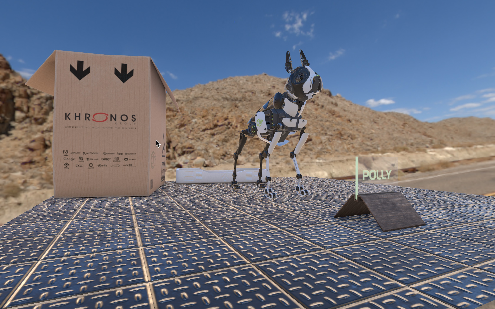

# GLTFKit

An Objective-C glTF 2.0 loader and Metal-based renderer



## Contents

This project consists of several related parts:

 - **GLTF.framework**: A glTF 2.0 loader framework written in Objective-C (and suitable for use in Swift)
 - **GLTFMTL.framework**: A framework for rendering glTF assets with Metal
 - **GLTFSCN.framework**: A framework for converting glTF scenes into SceneKit scenes
 - A viewer app for macOS
 - A SceneKit sample app for macOS

## Usage

### Using the Framework Projects

You can add the GLTF and GLTFMTL projects as subprojects of your own Xcode project, or build them using the provided workspace and copy the resulting framework binaries into your project.

To use GLTF.framework, link against and embed GLTF.framework.

To use the provided Metal renderer, also link against and embed GLTFMTL framework.

### Loading Assets

To load a glTF 2.0 model, import `<GLTF/GLTF.h>` and use the `GLTFAsset` class:

```obj-c
GLTFAsset *asset = [[GLTFAsset alloc] initWithURL:url bufferAllocator:bufferAllocator];
```

The URL must be a local file URL. Loading of remote assets and resources is not supported.

`bufferAllocator` is an object that knows how to allocate the memory into which glTF buffer data is loaded (it must conform to the `GLTFBufferAllocator` protocol). To render an asset with the provided Metal renderer, you may pass an instance of the concrete class `GLTFMTLBufferAllocator`, which is a specialized implementation of `GLTFBufferAllocator` that knows how to allocate GPU-accesible memory that can be read by Metal. To create such an allocator, you will need to provide it with a reference to a previously-created `MTLDevice` object:

```obj-c
id<MTLDevice> device = MTLCreateSystemDefaultDevice();
id<GLTFBufferAllocator> bufferAllocator = [[GLTFMTLBufferAllocator alloc] initWithDevice:device];
```

### Rendering Assets

#### Creating a Metal Renderer

To create Metal renderer, provide the same device that you use to create your assets:

```
renderer = [[GLTFMTLRenderer alloc] initWithDevice:device];
```

On the renderer, you need to configure the initial drawable size and pixel formats of the color and depth attachments so that they match those of the textures configured on your render passes. The Metal renderer currently does not support MSAA, nor can these pixel formats be changed once an asset has been drawn for the first time. 

If you are drawing into an `MTKView`, you can configure the renderer to match its settings:

```
renderer.drawableSize = mtkView.drawableSize;
renderer.colorPixelFormat = mtkView.colorPixelFormat;
renderer.depthStencilPixelFormat = mtkView.depthStencilPixelFormat;
```

#### Drawing

The renderer is designed to allow glTF assets to be drawn into the same render command encoder (pass) as other Metal draw calls.

Here is an example of creating a command buffer and command encoder and drawing a glTF asset:

```obj-c
id <MTLCommandBuffer> commandBuffer = [commandQueue commandBuffer];

MTLRenderPassDescriptor *renderPassDescriptor = mtkView.currentRenderPassDescriptor;

id <MTLRenderCommandEncoder> renderEncoder = [commandBuffer renderCommandEncoderWithDescriptor:renderPassDescriptor];

// ... additional command encoder configuration and draw calls ...

[renderer renderScene:asset.defaultScene
        commandBuffer:commandBuffer
       commandEncoder:renderEncoder];

// ... additional command encoder configuration and draw calls ...

[renderEncoder endEncoding];

[commandBuffer presentDrawable:mtkView.currentDrawable];

[commandBuffer addCompletedHandler:^(id<MTLCommandBuffer> buffer) {
    [renderer signalFrameCompletion];
}];

[commandBuffer commit];
```

Note that if your glTF asset contains transparent meshes, these will be drawn in the order they appear in the scene graph, and may therefore not composite correctly with opaque content or other content.

### Interoperating with SceneKit

The included GLTFSCN framework can be used to easily transform glTF assets into collections of `SCNScene`s to interoperate with SceneKit.

To get the collection of scenes contained in a glTF asset, use the `SCNScene` class extension method `+[SCNScene scenesFromGLTFAsset:options:]`. This method returns an array of scenes because there is no SceneKit type that represents a collection of scenes.

Here is an example of how to load a GLTF asset, convert it to a collection of SceneKit scenes, and access the default scene:

```obj-c
id<GLTFBufferAllocator> bufferAllocator = [[GLTFDefaultBufferAllocator alloc] init];
GLTFAsset *asset = [[GLTFAsset alloc] initWithURL:url bufferAllocator:bufferAllocator];
GLTFSCNAsset *scnAsset = [SCNScene assetFromGLTFAsset:asset options:@{}];
SCNScene *scene = scnAsset.defaultScene;
```

Note the use of the `GLTFDefaultBufferAllocator` type. This is a buffer allocator that allocates regular memory rather than GPU-accessible memory. If you want to use an asset with both Metal and SceneKit, you should use the `GLTFMTLBufferAllocator` (as illustrated above) instead.

## Status and Conformance

Below is a checklist of glTF features and their current level of support.

### Status

#### Encodings
- [x] JSON
- [x] Binary (.glb)

#### Buffer Storage
- [x] External references (`buffer.uri`)
- [x] Base-64 encoded buffers

#### Well-Known Vertex Accessor Semantics
  
- [x] POSITION
- [x] NORMAL
- [x] TANGENT
- [x] TEXCOORD_0
- [x] TEXCOORD_1
- [x] COLOR_0
- [x] JOINTS_0
- [x] WEIGHTS_0

#### Primitive Types
- [ ] Points
- [ ] Lines
- [ ] Line Loop
- [ ] Line Strip
- [x] Triangles
- [x] Triangle Strip
- [ ] Triangle Fan

#### Images
- [x] External image references (`image.uri`)
- [x] Base-64 encoded images
- [x] PNG
- [x] JPEG
- [x] TIFF
- [ ] OpenEXR
- [x] Radiance

#### Materials
- [x] Base color factor
- [x] Metallic factor
- [x] Roughness factor
- [x] Emissive factor
- [x] Base color map
- [x] Metallic-roughness map
- [x] Occlusion map
- [x] Emissive map
- [ ] Normal texture scale
- [x] Alpha mode
	- [x] Opaque alpha mode
	- [x] Mask alpha mode
	- [x] Blend alpha mode
- [x] Double-sided materials

#### Samplers
- [x] Wrap mode
- [x] Minification/magnification filters
- [x] Mipmaps

#### Cameras
- [x] Perspective cameras
- [x] Orthographic cameras

#### Morph Targets
- [ ] Morph targets
  
#### Animation
- [x] Translation animations
- [x] Rotation animations
- [x] Scale animations
- [ ] Morph target weight animations
- [x] Linear interpolation
- [ ] Discrete animations
- [ ] Cubic spline interpolation
- [ ] Catmull-Rom interpolation

#### Skinning
- [x] Joint matrix calculation
- [x] GPU-based vertex skinning

#### Sparse Accessors
- [ ] Sparse accessors

#### Extensions
- [ ] KHR_materials_pbrSpecularGlossiness
- [ ] KHR_materials_common
- [] KHR_lights
- [x] KHR_materials_unlit
- [x] KHR_texture_transform
- [x] EXT_pbr_attributes

### Conformance

This implementation is known to be **non-conforming** to the glTF 2.0 specification and is under active development.

## Contributing

Pull requests are gladly accepted, but will be audited strictly in order to maintain code style. If you have any concerns about contributing, please raise an issue on Github so we can talk about it.

## License

	 Copyright (c) 2018 Warren Moore. All rights reserved.
	
	 Permission to use, copy, modify, and distribute this software for any
	 purpose with or without fee is hereby granted, provided that the above
	 copyright notice and this permission notice appear in all copies.
	
	 THE SOFTWARE IS PROVIDED "AS IS" AND THE AUTHOR DISCLAIMS ALL WARRANTIES
	 WITH REGARD TO THIS SOFTWARE INCLUDING ALL IMPLIED WARRANTIES OF
	 MERCHANTABILITY AND FITNESS. IN NO EVENT SHALL THE AUTHOR BE LIABLE FOR
	 ANY SPECIAL, DIRECT, INDIRECT, OR CONSEQUENTIAL DAMAGES OR ANY DAMAGES
	 WHATSOEVER RESULTING FROM LOSS OF USE, DATA OR PROFITS, WHETHER IN AN
	 ACTION OF CONTRACT, NEGLIGENCE OR OTHER TORTIOUS ACTION, ARISING OUT OF
	 OR IN CONNECTION WITH THE USE OR PERFORMANCE OF THIS SOFTWARE.	
